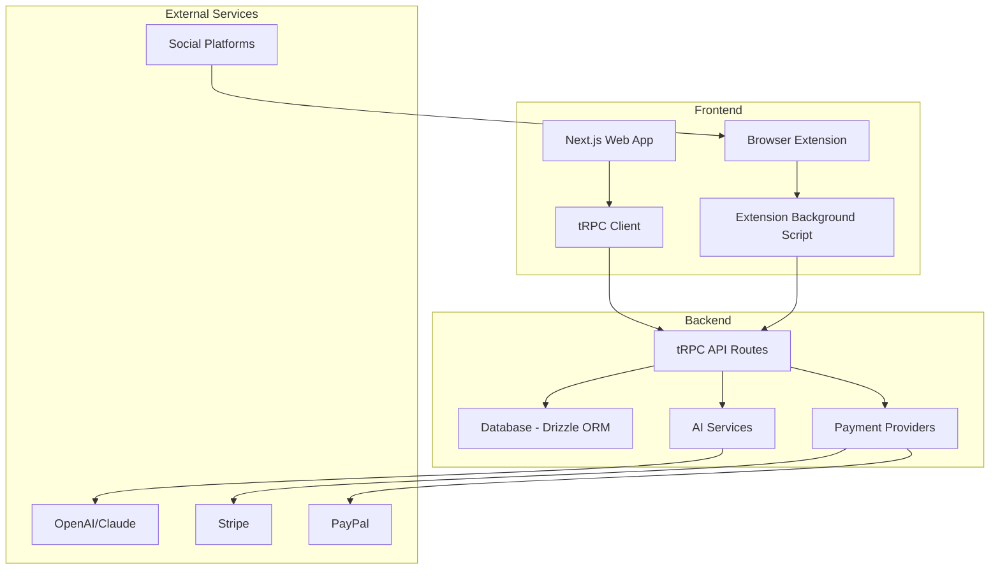

## What is ReplyIQ?

ReplyIQ is an intelligent SaaS platform that empowers users to create engaging, contextually-appropriate responses for social media platforms using advanced AI technology. Designed for social media managers, content creators, and businesses, ReplyIQ streamlines social media engagement across multiple platforms.

<Info>
  <b>API keys for AI services (OpenAI, Claude, Google, etc.) are required to generate AI-powered replies.</b> See the Quick Start section below for details on obtaining these keys.
</Info>

<Warning>
  <b>Security Note:</b> Never share your API keys publicly. Treat them as sensitive credentials.
</Warning>

<CardGroup cols={2}>
  <Card
    title="AI-Powered Replies"
    icon="robot"
    href="/features/ai-reply-generation"
  >
    Generate contextual replies using advanced AI models like GPT-4, Claude, and more
  </Card>
  <Card
    title="Multi-Platform Support"
    icon="share-nodes"
    href="/features/multi-platform-support"
  >
    Works seamlessly with Twitter/X, LinkedIn, Facebook, and more platforms
  </Card>
  <Card
    title="Browser Extension"
    icon="puzzle-piece"
    href="/extension/overview"
  >
    Seamless integration directly on social media platforms with our browser extension
  </Card>
  <Card
    title="Analytics Dashboard"
    icon="chart-line"
    href="/dashboard/usage-analytics"
  >
    Track engagement, usage statistics, and optimize your social media strategy
  </Card>
</CardGroup>

## Key Features

<AccordionGroup>
  <Accordion title="🎯 AI-Powered Reply Generation">
    Generate contextual, engaging replies using state-of-the-art AI models. Choose from multiple tone options including professional, casual, friendly, and more.
  </Accordion>

  <Accordion title="🌐 Multi-Platform Integration">
    Seamlessly work across Twitter/X, LinkedIn, Facebook, and other major social media platforms with platform-specific optimizations.
  </Accordion>

  <Accordion title="😊 Smart Emoji Suggestions">
    Get context-aware emoji recommendations that enhance your replies and increase engagement rates.
  </Accordion>

  <Accordion title="🔧 Complete SaaS Platform">
    Full-featured SaaS with user authentication, subscription management, usage tracking, and comprehensive admin dashboard.
  </Accordion>

  <Accordion title="🚀 Browser Extension">
    Chrome, Firefox, and Edge compatible extension that works directly on social media platforms for seamless workflow integration.
  </Accordion>

  <Accordion title="📊 Real-time Analytics">
    Monitor engagement metrics, track usage patterns, and optimize your social media strategy with detailed analytics.
  </Accordion>
</AccordionGroup>

## Quick Start

Get up and running with ReplyIQ in minutes:

<Steps>
  <Step title="Sign Up">
    Create your ReplyIQ account at [replyiq.com](https://replyiq.com)
  </Step>
  <Step title="Configure AI Models">
    Set up your preferred AI providers in the dashboard:
    <ul>
      <li>Navigate to <b>Dashboard → Settings → General → AI Model Provider</b></li>
      <li>Obtain API keys from each provider's website:
        <ul>
          <li><b>OpenAI:</b> [https://platform.openai.com/account/api-keys](https://platform.openai.com/account/api-keys)</li>
          <li><b>Anthropic (Claude):</b> [https://console.anthropic.com/settings/keys](https://console.anthropic.com/settings/keys)</li>
          <li><b>Google AI (Gemini):</b> [https://makersuite.google.com/app/apikey](https://makersuite.google.com/app/apikey)</li>
        </ul>
      </li>
      <li>Enter your API keys and save your configuration</li>
    </ul>
  </Step>
  <Step title="Install Browser Extension">
    Download and install the ReplyIQ browser extension for your preferred browser (Chrome, Firefox, Edge). 
    <b>Note:</b> The extension may not be available in all regions. Check for updates after installation.
  </Step>
  <Step title="Start Generating Replies">
    Navigate to any supported social media platform and start generating AI-powered replies!
  </Step>
</Steps>

## Architecture Overview

ReplyIQ is built with modern technologies for scalability and performance:

## Tech Stack

<CardGroup cols={3}>
  <Card title="Frontend" icon="code">
    - Next.js 14 with App Router
    - TypeScript & Tailwind CSS
    - shadcn/ui components
    - Zustand state management
  </Card>
  <Card title="Backend" icon="server">
    - tRPC for type-safe APIs
    - PostgreSQL with Drizzle ORM
    - NextAuth.js authentication
    - Stripe & PayPal integration
  </Card>
  <Card title="Extension" icon="puzzle-piece">
    - WXT framework with React
    - TypeScript & Vite
    - Cross-browser compatibility
    - Real-time sync with web app
  </Card>
</CardGroup>

## Support & Community

<CardGroup cols={2}>
  <Card
    title="Documentation"
    icon="book-open"
    href="/guides/getting-started"
  >
    Comprehensive guides and API documentation
  </Card>
  <Card
    title="Community Support"
    icon="users"
    href="https://discord.gg/replyiq"
  >
    Join our Discord community for help and discussions
  </Card>
  <Card
    title="GitHub Repository"
    icon="github"
    href="https://github.com/alexgutscher26/ReplyIQ"
  >
    View source code and contribute to the project
  </Card>
  <Card
    title="Contact Support"
    icon="envelope"
    href="mailto:support@replyiq.com"
  >
    Get direct support from our team
  </Card>
  <Card
    title="FAQ"
    icon="question-circle"
    href="/support/faq"
  >
    Frequently asked questions and troubleshooting
  </Card>
</CardGroup>

---

_Last updated: 2024-06-09_

Ready to get started? Check out our [Quick Start Guide](/quickstart) or explore the [API Reference](/api-reference/introduction).