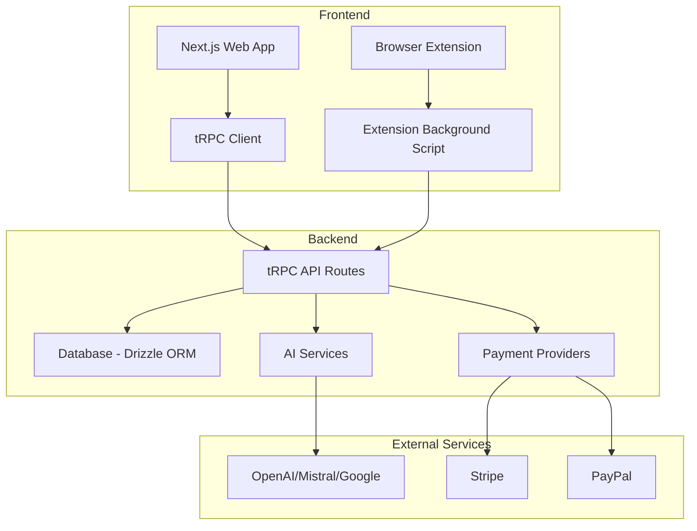

## What is ReplyIQ?

ReplyIQ is an intelligent SaaS platform that empowers users to create engaging, contextually-appropriate content for social media platforms using advanced AI technology. Designed for social media managers, content creators, and businesses, ReplyIQ streamlines social media content creation and engagement across multiple platforms.

<Info>
  <b>API keys for AI services (OpenAI, Mistral, Google, etc.) are required to generate AI-powered content.</b> See the Quick Start section below for details on obtaining these keys.
</Info>

<Warning>
  <b>Security Note:</b> Never share your API keys publicly. Treat them as sensitive credentials.
</Warning>

<CardGroup cols={2}>
  <Card
    title="AI-Powered Content Generation"
    icon="robot"
    href="/features/ai-reply-generation"
  >
    Generate contextual content using advanced AI models like GPT-4, Mistral, and more
  </Card>
  <Card
    title="Multiple Content Tools"
    icon="tools"
    href="/features/hashtag-generator"
  >
    Create hashtags, image captions, video scripts, threads, stories, and more
  </Card>
  <Card
    title="Browser Extension"
    icon="puzzle-piece"
    href="/extension/overview"
  >
    Seamless integration directly on social media platforms with our browser extension
  </Card>
  <Card
    title="Analytics Dashboard"
    icon="chart-line"
    href="/dashboard/analytics"
  >
    Track usage statistics and optimize your social media strategy
  </Card>
</CardGroup>

## Key Features

<AccordionGroup>
  <Accordion title="🎯 AI-Powered Content Generation">
    Generate contextual, engaging content using state-of-the-art AI models. Choose from multiple tone options including professional, casual, friendly, and more.
  </Accordion>

  <Accordion title="🔤 Hashtag Generator">
    Create relevant and trending hashtags for your social media posts to increase visibility and engagement.
  </Accordion>

  <Accordion title="📸 Image Caption Generator">
    Generate compelling captions for your images that drive engagement and tell your story.
  </Accordion>

  <Accordion title="🌐 Language Translator">
    Translate your content into multiple languages to reach a global audience.
  </Accordion>

  <Accordion title="😊 Smart Emoji Suggestions">
    Get context-aware emoji recommendations that enhance your content and increase engagement rates.
  </Accordion>

  <Accordion title="🧠 Sentiment Analysis">
    Analyze the sentiment of text to understand the emotional tone and adjust your messaging accordingly.
  </Accordion>

  <Accordion title="📚 Story Generator">
    Create engaging stories for social media platforms like Instagram and Facebook.
  </Accordion>

  <Accordion title="🧵 Thread Generator">
    Generate coherent and engaging thread content for platforms like Twitter/X.
  </Accordion>

  <Accordion title="🎬 Video Script Generator">
    Create compelling scripts for your video content across various platforms.
  </Accordion>

  <Accordion title="🔧 Complete SaaS Platform">
    Full-featured SaaS with user authentication, subscription management, usage tracking, and comprehensive dashboard.
  </Accordion>

  <Accordion title="📊 Analytics">
    Monitor usage patterns and optimize your social media strategy with detailed analytics.
  </Accordion>
</AccordionGroup>

## Quick Start

Get up and running with ReplyIQ in minutes:

<Steps>
  <Step title="Sign Up">
    Create your ReplyIQ account at [replyiq.com](https://replyiq.com)
  </Step>
  <Step title="Configure AI Models">
    Set up your preferred AI providers in the dashboard:
    <ul>
      <li>Navigate to <b>Dashboard → Settings → General → AI Model Provider</b></li>
      <li>Obtain API keys from each provider's website:
        <ul>
          <li><b>OpenAI:</b> [https://platform.openai.com/account/api-keys](https://platform.openai.com/account/api-keys)</li>
          <li><b>Mistral AI:</b> [https://console.mistral.ai/api-keys/](https://console.mistral.ai/api-keys/)</li>
          <li><b>Google AI (Gemini):</b> [https://makersuite.google.com/app/apikey](https://makersuite.google.com/app/apikey)</li>
        </ul>
      </li>
      <li>Enter your API keys and save your configuration</li>
    </ul>
  </Step>
  <Step title="Install Browser Extension">
    Download and install the ReplyIQ browser extension for your preferred browser. 
    <b>Note:</b> The extension may not be available in all regions. Check for updates after installation.
  </Step>
  <Step title="Start Creating Content">
    Use the dashboard tools or browser extension to start generating AI-powered content!
  </Step>
</Steps>

## Architecture Overview

ReplyIQ is built with modern technologies for scalability and performance:

## Tech Stack

<CardGroup cols={3}>
  <Card title="Frontend" icon="code">
    - Next.js 15 with App Router
    - TypeScript & Tailwind CSS
    - shadcn/ui components
  </Card>
  <Card title="Backend" icon="server">
    - tRPC for type-safe APIs
    - PostgreSQL with Drizzle ORM
    - Better Auth authentication
    - Stripe & PayPal integration
  </Card>
  <Card title="AI Integration" icon="brain">
    - AI SDK for multiple providers
    - OpenAI, Mistral, Google AI
    - Custom prompt engineering
  </Card>
</CardGroup>

## Support & Community

<CardGroup cols={2}>
  <Card
    title="Documentation"
    icon="book-open"
    href="/guides/getting-started"
  >
    Comprehensive guides and API documentation
  </Card>
  <Card
    title="GitHub Repository"
    icon="github"
    href="https://github.com/alexgutscher26/ReplyIQ"
  >
    View source code and contribute to the project
  </Card>
  <Card
    title="Contact Support"
    icon="envelope"
    href="mailto:support@replyiq.com"
  >
    Get direct support from our team
  </Card>
  <Card
    title="FAQ"
    icon="question-circle"
    href="/support/faq"
  >
    Frequently asked questions and troubleshooting
  </Card>
</CardGroup>

---

_Last updated: 2025-07-01_

Ready to get started? Check out our [Quick Start Guide](/quickstart) or explore the [API Reference](/api-reference/introduction).